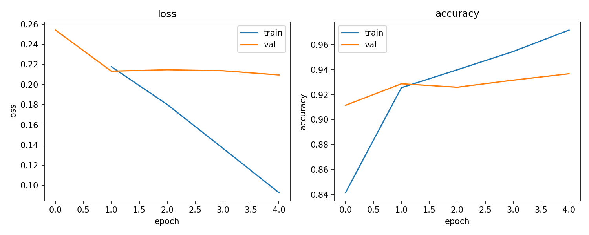
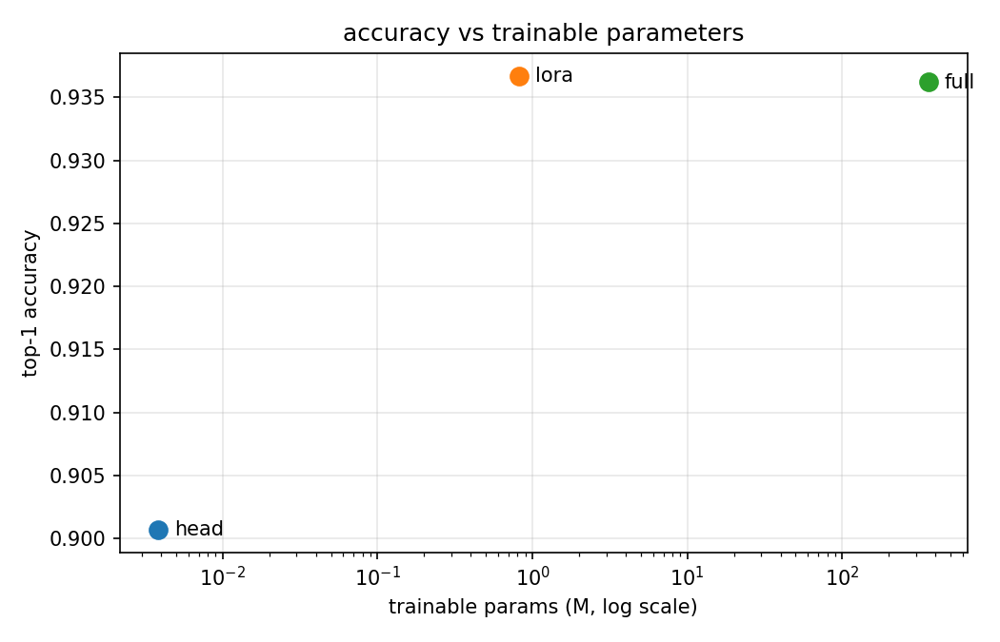
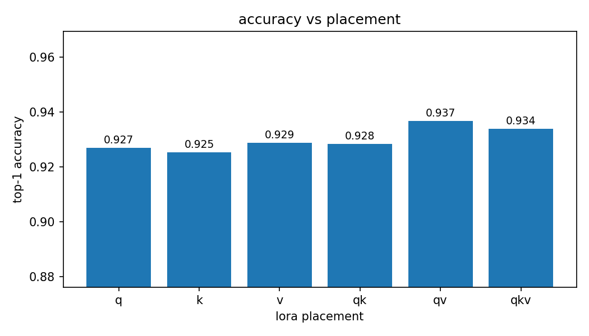
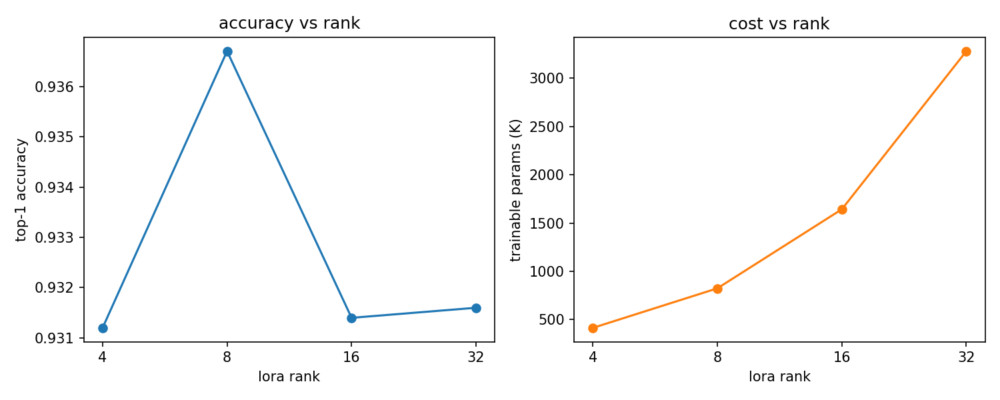

# Parameter-Efficient Fine-Tuning of a Small Language Model (LoRA)

## 📌 Project Overview
This project demonstrates **parameter-efficient fine-tuning** of a small **decoder-only language model** for text classification using **LoRA** — strictly low-rank updates, no other PEFT method. A pretrained backbone is adapted to a new dataset by learning small low-rank deltas on the attention **query/value** projections, while the backbone itself stays frozen. This reaches near full fine-tuning accuracy while updating only a tiny fraction of the weights. The backbone is deliberately small — the same decoder-only architecture as full-size LLMs, sized to train comfortably on a single 8 GB GPU; the method itself is what the LoRA paper shows to be size-agnostic.

**Dataset**: AG News (4 news topics: World, Sports, Business, Sci/Tech).  
**Backbone**: `HuggingFaceTB/SmolLM2-360M` with a classification head, via `transformers`.  
**Goal**: Strong top-1 accuracy while training well under 5% of the model's parameters.

I built this as hands-on preparation for the PEFT/LoRA side of my thesis; everything here is a standalone prototype on public data and public weights.


---

## 🚀 Key Features
1. **Hand-Written LoRA**:
   - Low-rank matrices injected into the attention q/v projections (`B · A · x · α/r`, with `α = 2r` and `B` zero-initialised so training starts exactly from the pretrained model). HF decoder blocks keep q/k/v as separate Linears, so each projection is wrapped on its own.
   - Placement follows the original [LoRA paper (Hu et al., 2022)](https://arxiv.org/abs/2106.09685), whose placement study (§7.1) found adapting **q and v** the best use of a fixed parameter budget — k contributes least.
   - Only the LoRA matrices and the classifier head are trainable; the backbone is fully frozen.
2. **Rank Ablation**:
   - One command sweeps the LoRA rank over {4, 8, 16, 32} and plots accuracy and cost against rank.
3. **Tiny Checkpoints**:
   - Only the LoRA weights and head are saved — a few MB instead of the full 1.4 GB backbone. Inference rebuilds the model from public pretrained weights and loads the LoRA weights on top.
4. **Solid Training Recipe**:
   - AdamW with a 2-epoch linear warmup into cosine decay, mixed precision, on-the-fly tokenization.
5. **Configurable with Hydra**:
   - Data, model, and training settings live in `configs/` and can be overridden straight from the command line.
6. **Experiment Tracking**:
   - Metrics are logged to Weights & Biases in **offline** mode by default, so it runs without an account.

---

## 🔍 Findings
- **Top-1 Accuracy**: **93.7%** on the full AG News test set (weighted average recall, WAR), best run with rank 8 on q/v.
- **Trainable Parameters**: 823K out of 362.6M — just **0.23%** of the model.
- **Setup**: LoRA rank 8 on q/v, 5 epochs on a 20K-example subsample of the train split (eval always uses the full 7,600-example test split), AdamW with warmup + cosine decay, mixed precision.
- **Takeaway**: LoRA matches full fine-tuning while training a quarter of a percent of the weights.



### Baselines: how much does LoRA actually buy?
The comparison that matters: LoRA against a frozen-backbone **linear probe** (lower bound) and **full fine-tuning** (upper bound), all under the same protocol:

| method | top-1 acc (WAR) | trainable params | checkpoint | s/epoch | peak VRAM |
|------------------|-----------------|------------------|------------|---------|-----------|
| linear probe     | 90.1%           | 3.8K (0.001%)    | 0.02 MB    | 109     | 1.8 GB    |
| LoRA r=8 (ours)  | **93.7%**       | 823K (0.23%)     | 3.2 MB     | 285     | 6.7 GB    |
| full fine-tuning | 93.6%           | 361.8M (100%)    | 1380 MB    | 2803    | 7.9 GB*   |

\* full fine-tuning runs at batch 8 (the others at 32) to fit fp32 gradients and AdamW states for all 362M parameters into 8 GB — its per-sample memory is far higher, so the raw VRAM numbers are not directly comparable.

LoRA beats the linear probe by **+3.6 points**, so the frozen features alone leave real accuracy on the table — and it matches full fine-tuning (93.7% vs 93.6%) while training **440× fewer parameters**, with a **430× smaller checkpoint** and roughly a tenth of the epoch time. On a 20K-example subsample, updating all 362M weights buys nothing that the low-rank update doesn't already deliver; this mirrors the LoRA paper, which reports LoRA matching or outperforming full fine-tuning on most benchmarks.



### Placement Ablation
Which projections should carry the LoRA update? Sweeping every q/k/v subset at rank 8:

| placement | top-1 acc (WAR) | trainable params | % of total |
|-----------|-----------------|------------------|------------|
| q         | 92.7%           | 495K             | 0.14%      |
| k         | 92.5%           | 332K             | 0.09%      |
| v         | 92.9%           | 332K             | 0.09%      |
| q + k     | 92.8%           | 823K             | 0.23%      |
| q + v     | **93.7%**       | 823K             | 0.23%      |
| q + k + v | 93.4%           | 1.15M            | 0.32%      |

**q + v wins.** k is the weakest single placement, and q+k — the same parameter budget as q+v — trails it by 0.8 points: q and k only shape the attention pattern through their inner product, so adapting q already covers most of what k could add, while v changes the content being mixed and is complementary. Spending extra parameters to add k on top of q+v also helps nothing. This reproduces the placement study in [the LoRA paper](https://arxiv.org/abs/2106.09685) (§7.1, Table 5).



### Rank Ablation
With placement fixed at q+v, sweeping the rank shows the sweet spot is small — rank 8 is the peak, rank 4 is already within 0.6 points of it, and ranks 16 and 32 buy nothing for 2–4× the parameters:

| rank | top-1 acc (WAR) | trainable params | % of total |
|------|-----------------|------------------|------------|
| 4    | 93.1%           | 413K             | 0.11%      |
| 8    | **93.7%**       | 823K             | 0.23%      |
| 16   | 93.1%           | 1.64M            | 0.45%      |
| 32   | 93.2%           | 3.28M            | 0.90%      |



Ablation numbers are single runs with the default recipe; reruns move individual cells by ±0.3 points. The repo default (rank 8 on q/v) is the configuration both sweeps select.

---

## ⚙️ How to Run
Works on Linux, macOS and Windows.

```bash
git clone https://github.com/headless-start/peft-lora-llm.git
cd peft-lora-llm

python -m venv .venv
source .venv/bin/activate          # linux / macos
# .venv\Scripts\activate           # windows

pip install -r requirements.txt
```

For GPU training install the CUDA build of PyTorch from [pytorch.org](https://pytorch.org/get-started/locally/) first; the plain `pip install` gives you a CPU build on some platforms.

```bash
# full run on AG News (downloads the backbone and dataset on first use)
python train.py

# override anything from the command line
python train.py train.epochs=3 data.batch_size=16 model.lora.r=16
```

Sweep the LoRA rank (writes `results/ablation.json` and `results/ablation.png`):

```bash
python ablate.py                    # ranks 4, 8, 16, 32
python ablate.py --ranks 4,8
```

Sweep the LoRA placement over q/k/v subsets at fixed rank (writes `results/placement.json` and `results/placement.png`):

```bash
python ablate.py --placements q,k,v,qk,qv,qkv --ranks 8
```

Compare LoRA against the baselines — linear probe and full fine-tuning (writes `results/baselines.json` and `results/baselines.png`):

```bash
python baselines.py
```

Classify your own news snippets with a trained checkpoint:

```bash
python predict.py "Stocks rallied after the central bank held rates steady."
# Stocks rallied after the central bank held rates steady.: Business (96.5%), World (3.4%)
```

Quick smoke test (CPU, small random-init backbone, no downloads):

```bash
python train.py +experiment=smoke
```

Runs are logged to Weights & Biases offline by default; to sync to the cloud:

```bash
wandb login
python train.py wandb.mode=online
```

Training curves and `metrics.json` are written to `results/`; checkpoints go to `outputs/`.

---

## 🛠 System Requirements
### Dependencies
- Python 3.10+
- Libraries: `torch`, `transformers`, `datasets`, `hydra-core`, `wandb`, `matplotlib`
- Hardware: CUDA GPU recommended (a CPU smoke run is supported)

### Reproducibility
- Runs on Linux, macOS and Windows; all paths and commands are OS-agnostic.
- Seeds are fixed (`seed: 42`). Reported numbers came from Python 3.13, `torch` 2.12, `transformers` 5.11, `datasets` 5.0 on a single RTX 4060; expect individual cells to move by ±0.3 points across reruns and library versions due to GPU non-determinism.
- On machines with little RAM, add `data.num_workers=0` to any command.

---

## 📄 License
This project is licensed under the MIT License. See the [LICENSE](LICENSE) file for details.
